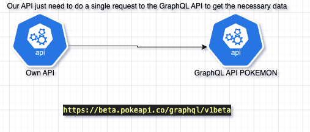

# Starting point
# Diagram
## Fuctional requirements
- Validate which of the 5 locations are inside of the region Kanto
- Get the areas of each location that are inside of the region kanto
- get data of the diffent pokemons that live in the validated locations
- Recommend the best area to find the most diverse group of Pokemon (Optional).

The previous items must to be done using the [pokemon API](https://pokeapi.co/)

## Issues
The principal issue using the REST api is the "under-fetching", we would have to do a lot of requests to different endpoints to perform the task, because the data we need are spread among different endpoints, on each request we get a necessary data but not enough to achieve  our tasks leading us to the underfetching,

The solution is easy, instead of using the REST API, we need to use the GraphQL because we can get the necessary data just making a single request.

# Running project
## Using Docker
we need just the next command:
docker-compose up --build

## Using Virtual env
- Create a new virtual enviroment
- Activate the virtual env
- run pip install -r requirements.txt
- change to the dir src
- run uvicorn main:app or run pytest to run the tests